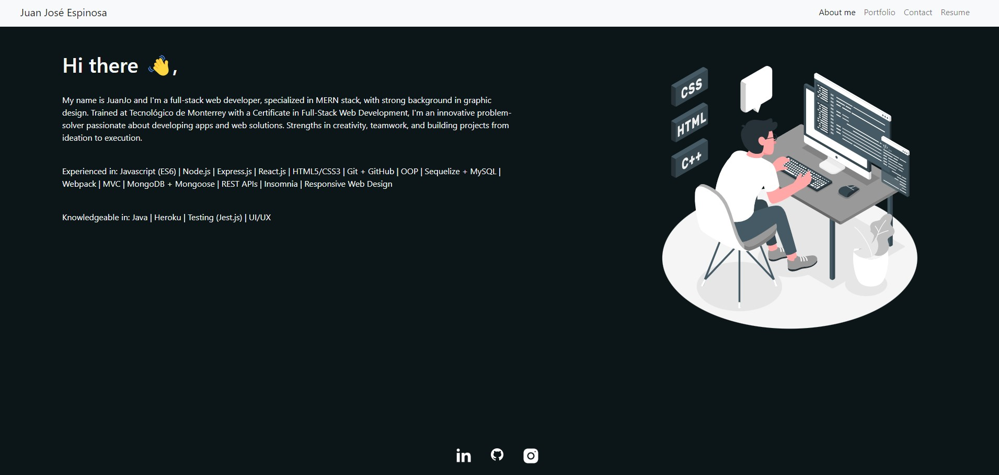

# React-Portfolio
## [Description](#table-of-contents)

React Portfolio where users can see my most recent projects and works. The app contains four sections: About, Portfolio, Contact and Projects. 

Deployed with [GithHub Pages](https://jcuetos97.github.io/React-Portfolio/).

## Table of Contents
* [Description](#description)
* [Installation](#installation)
* [License](#license)
* [Contributing](#contributing)
* [Technologies](#technologies)
* [Questions](#questions)

## [Installation](#table-of-contents)

- Download or clone repository to use this application on local machine.
- To install necessary dependencies, navigate to the root directory and run the following command: `npm install`

## [Usage](#table-of-contents)
- After installation, run `npm run start`.

## [License](#table-of-contents)

The application is covered under the following license:
[ISC](https://choosealicense.com/licenses/isc)

## [Contributing](#table-of-contents)

For the moment this project does not accept contributions from third parties. Thank you for your interest.

## [Technologies](#table-of-contents)

This application was built with: 
- [JavaScript](https://developer.mozilla.org/en-US/docs/Web/JavaScript)
- [React.js](https://beta.reactjs.org/)
- [Node.js](https://nodejs.org/en/)

## [Questions](#table-of-contents)

Please feel free to contact me using the following links:
* [GitHub: jcuetos97](https://github.com/jcuetos97)
* [Email: jcuetos97@gmail.com](mailto:jcuetos97@gmail.com)
* [LinkedIn: jcuetos97](https://www.linkedin.com/in/jcuetos97/)
* [Website: jcuetos97](https://jcuetos97.github.io/Web-Developer-Portfolio/)
